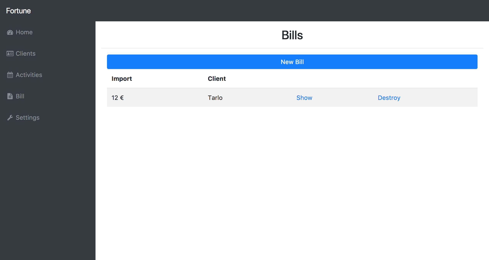

# FORTUNE
Fortune is a web-app, to create invoices. We tried to make the graphics as intuitive as possible in order to simplify and optimize the training time of future users. Major feature are management of users, activities and bills. This feature can be access directly from the homepage.

## Client
In the "Clients" page you can have a list of all the customers for which that user works. From this you can insert a  new client.

The system can maintain trace of the difference between a Business Client and a private client, so don’t require to insert at example of the surname and permit to evalutate different identification format.

## Activity
You can insert the activity made by a client, simply selecting the client and the hour worked.

The application permit to remove only the activities not billed, so you can be sure that you didn't lost your activities for error :smiley:

## Bill
The system permit to create new bill in seconds by only select the client other data are automatic filled by the system.

After the bill creation you can show the invoice PDF and print or download it by clicking to “Show PDF”.

The Invoice contain the data about the customer, the hours worked and the relative amount, based on the price for hour that you have set.

## Settings

The invoices template model can upload on the settings page. 

## Install
Would you try our product follow the step on [doc/INSTALL.md](./doc/INSTALL.md) file.
## What did(not) we like in the group?

As a group we worked well, setting our deadlines and priorities. We followed the User Stories done at the beginning, although very often we wanted to expand them by inserting new features. It was interesting to work in a team especially to be able to compare and to combine different skills of the components of the group. However there was some communication problem. This came from a lack of experience on different IT sector and a different view about the quality.