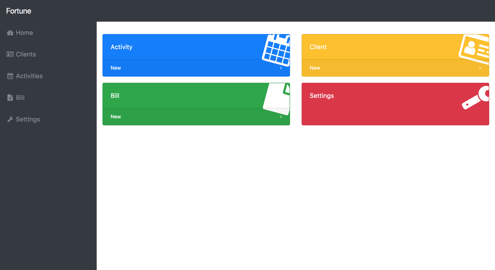
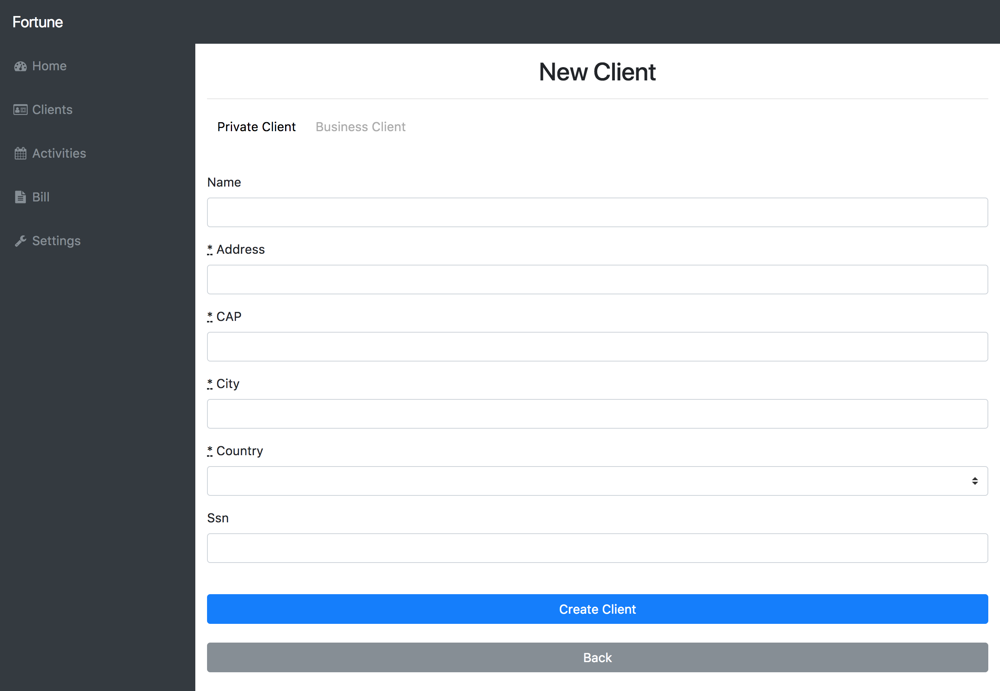
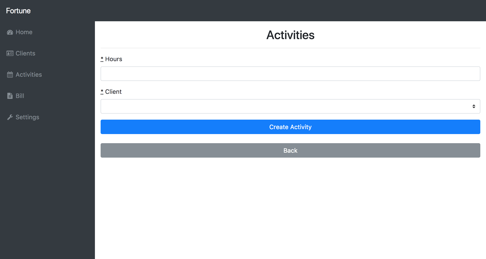
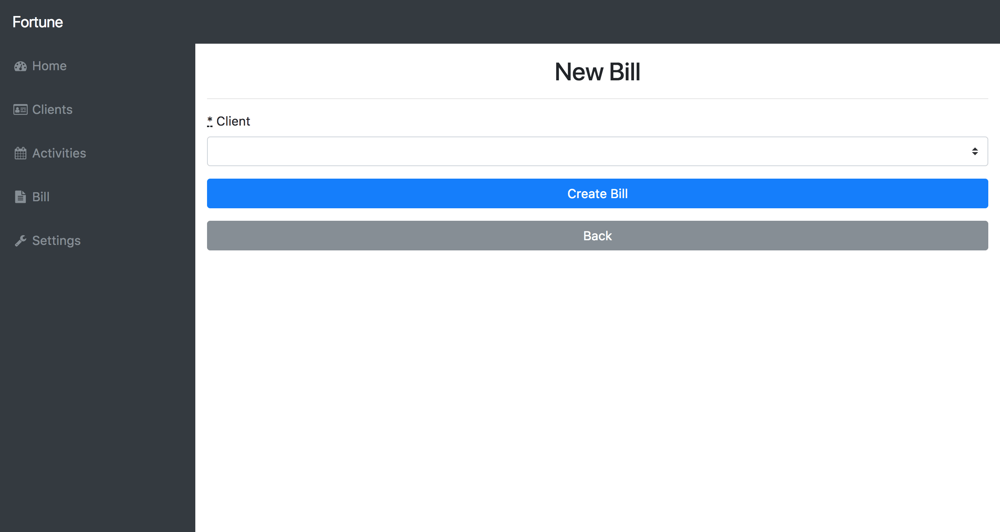
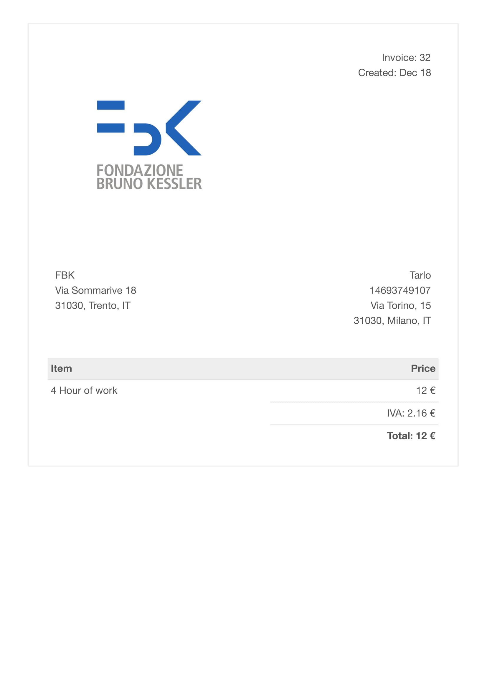
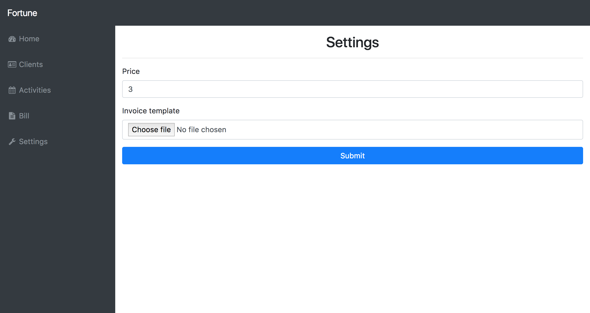

# FORTUNE
Fortune is a web-app, to create invoices. We tried to make the graphics as intuitive as possible in order to simplify and optimize the training time of future users. Major feature are management of [clients](#client), [activities](#activity) and [bills](#bill). This feature can be access directly from the homepage.

## Client
You can show you're list of customers. Also you can make the minimal operation of delete update and insertion on the client. Also the system deny you to execute delete operation if you have create some bills or activities about it.

The system can maintain trace of the difference between a business client and a private client, so don’t require to insert at example of the surname and you're sure that the identification code insert is correct.

## Activity
You can insert the activity made by a client, simply selecting the client and the hour worked.

The application permit to remove only the activities not billed, so you can be sure that you didn't lost your activities for error :smiley:

## Bill
The system permit to create new bill in seconds by only select the client, other data are automatic filled by the system.

After the bill creation you can show the invoice PDF and print or download it by clicking to “Show PDF”.
The Invoice contain the data about the customer, the hours worked and the relative amount, based on the price for hour that you have set. If you like this template take from [Sparksuite Simple HTML Invoice Template](https://github.com/sparksuite/simple-html-invoice-template)

## Other application function

By the menu you can upload a custom template by the settings page or change the price for hour used on the bill.

## Install
Would you try our product? Follow step on [doc/INSTALL.md](./doc/INSTALL.md) file.