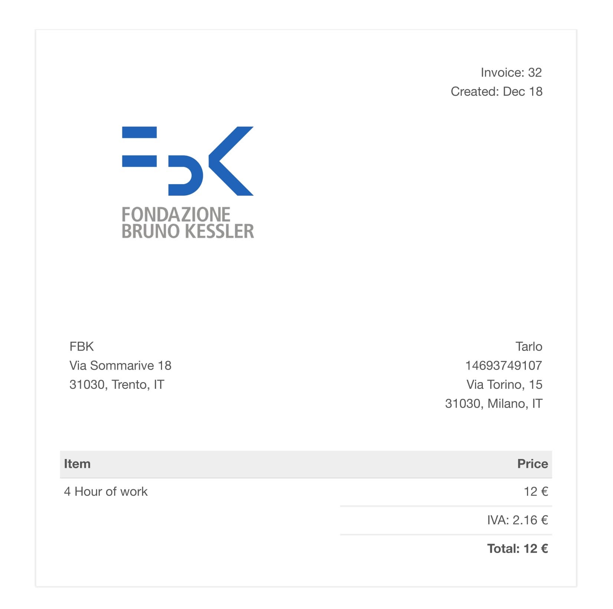

# FORTUNE
Fortune is a web-app, to create invoices. We tried to make the graphics as intuitive as possible in order to simplify and optimize the training time of future users. Major feature are management of users, activities and bills. This feature can be access directly from the homepage.

## The developed system

Our team composed by Matteo Bortolon and Jessica Lucchetta, has created Fortune, a web application, to create invoices. The application is divided into several pages and offers certain services to the user who connects and starts using Fortune. We tried to make the graphics as intuitive as possible in order to simplify and optimize the training time of future users. From the home you can access the major and most important features to create: new &quot;Client&quot;, &quot;Activity&quot;, &quot;Bill&quot;. For these features we have also created dedicated pages, in which you can do other activities: in the &quot;Clients&quot; page you can have a list of all the customers for which that user works, in the &quot;Bills&quot; page there is the complete list of invoices and in the &quot;Activities&quot; page you will have a list of all the hours worked by the user for a specific customer. Then for each customer / activity / bill you can see the details of the item, you can delete it or change it. We made sure that for each invoice there is the possibility, through &quot;Show PDF&quot;, to create the PDF file of the invoice of a specific customer, in which we specified the hours worked for that particular person and the relative amount of work. In this way the user can download it and send it to the customer. The last page created is &quot;Settings&quot; where you can set the hourly price that you want to apply for the determination of the amount of the invoice. You can also change the template of the invoice that you will have in the PDF. For install the system watch [doc/INSTALL.md](./doc/INSTALL.md)

## What did(not) we like in the group?

As a group we worked well, setting our deadlines and priorities. We followed the User Stories done at the beginning, although very often we wanted to expand them by inserting new features. It was interesting to work in a team especially to be able to compare and to combine different skills of the components of the group. However there was some communication problem. This came from a lack of experience on different IT sector and a different view about the quality.